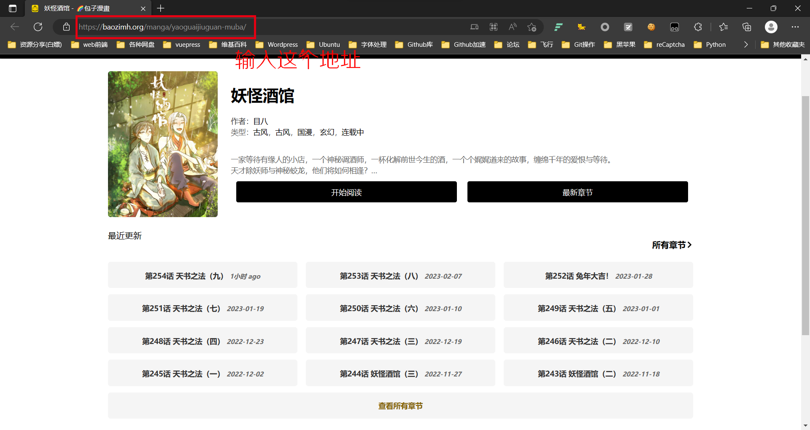

# 声明: 本爬虫仅供学习(应该没人会看我写的吧:rofl:)。

# 项目介绍:

## 爬取地址:

**[包子漫画](https://baozimh.org)**

## 爬虫框架:

**BeautifulSoup**

- BeautifulSoup官方文档: [https://beautifulsoup.cn](https://beautifulsoup.cn/)

## 依赖库

```shell
bs4(BeautifulSoup)
requests
fake_useragent
PIL(pillow)
PyPDF2
sys
time
os
shutil
re
```

# 使用方法

## Step1. 安装依赖

```shell
pip install pillow requests fake_useragent bs4 PyPDF2
```

## Step2. 获取漫画地址

1. 点击首页想看的漫画

2. 查看漫画链接

3. 运行程序，在`input`中输入地址

​	**注意:** 输入地址时不要忘记最后的正斜杠(**/**) 

​	正确的地址:`https://baozimh.org/manga/yaoguaijiuguan-muba/`

​	错误的地址:`https://baozimh.org/manga/yaoguaijiuguan-muba`, `https://baozimh.org/chapterlist/yaoguaijiuguan-muba/`, `https://baozimh.org/chapterlist/yaoguaijiuguan-muba`等等。

# BUG?

在使用中如果出现bug，请前往反馈，[点这里](https://github.com/LemonFan-maker/Comic_Spider/issues)

**注意：**提交Bug时，请复制所有报错信息，并附加漫画地址。

# TDL

1. 修复错误
2. 支持github action 打包下载
3. 更新pic2PDF
4.  ,etc

